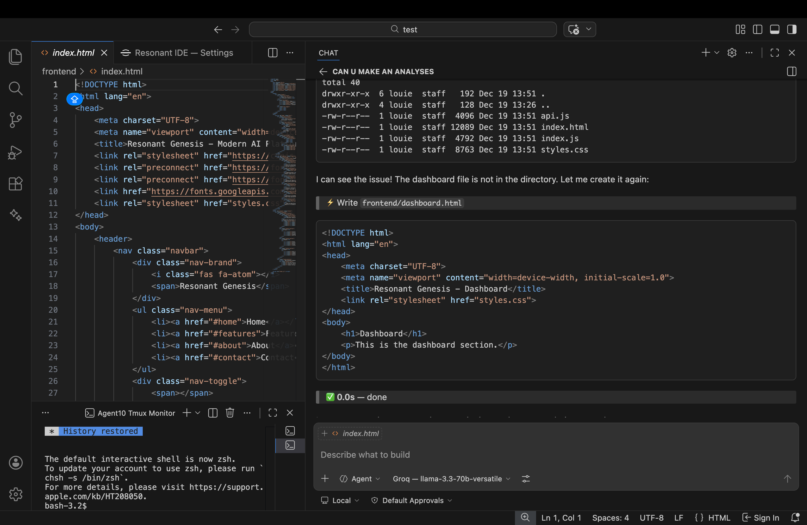
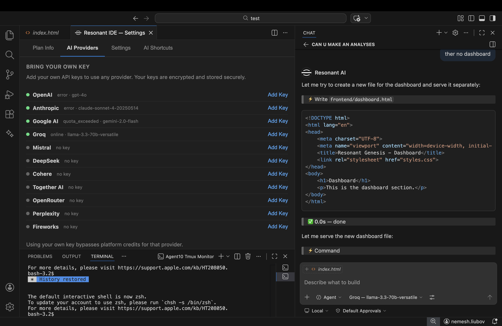
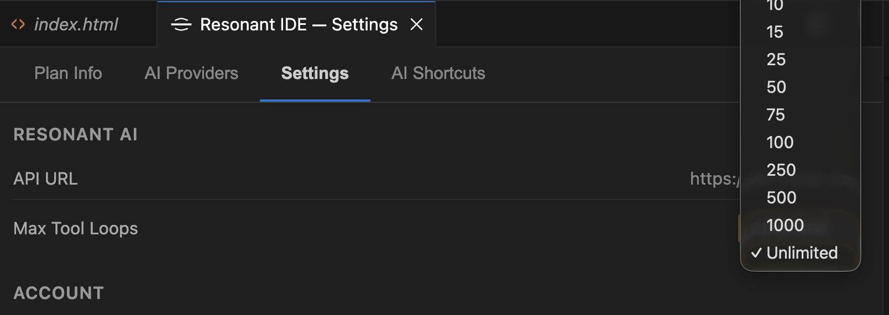
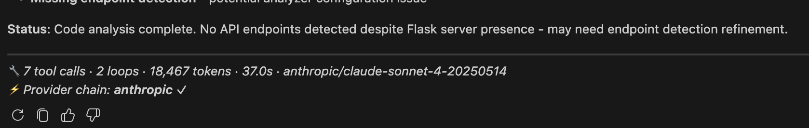
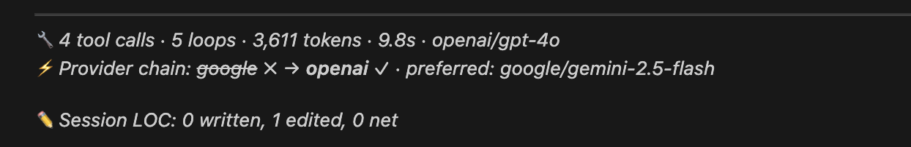
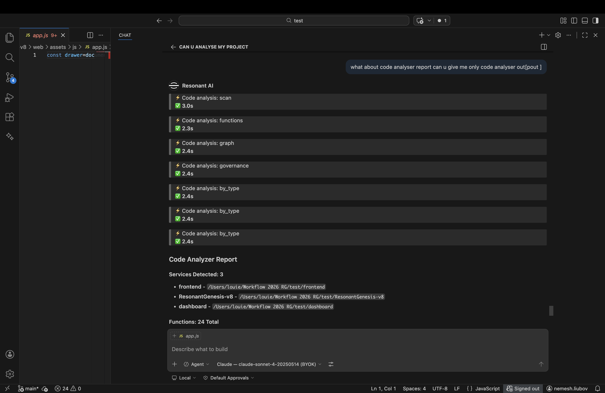
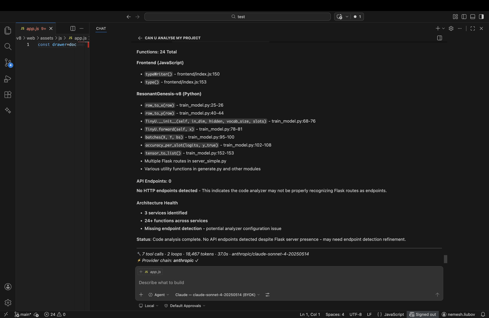

<div align="center">

# Resonant IDE

### The AI-Native Development Environment by Resonant Genesis

**Created by [Louie Nemesh](https://dev-swat.com)**

[](LICENSE.txt)
[](https://dev-swat.com)

[Manual Install](#getting-started) · [Documentation](https://dev-swat.com/docs) · [Platform](https://dev-swat.com) · [Report Issue](https://dev-swat.com/feedback)

</div>

---

## What is Resonant IDE?

**Resonant IDE** is a full-featured AI-native code editor built on the VS Code Open Source foundation, deeply integrated with the **Resonant Genesis** AI governance platform. Unlike traditional editors that bolt on AI as an afterthought, Resonant IDE was designed from the ground up with AI at its core — every feature, every tool, every workflow is AI-first.

This is not a wrapper. This is not a plugin. This is a **complete development environment** where the AI assistant has the same capabilities as you: it reads your files, runs your commands, searches your codebase, manages your git, edits your notebooks, browses the web, and deploys your code — all through a governed, auditable, identity-bound execution pipeline.

### Screenshots

<div align="center">

**AI Chat + Editor + Terminal — Unified Workspace**



**11 AI Providers with BYOK (Bring Your Own Key)**



**Configurable Max Tool Loops — Up to Unlimited**



</div>

### Key Differentiators

| Feature | Resonant IDE | Traditional Editors | AI Wrappers |
|---------|-------------|-------------------|-------------|
| **Native AI Agent** | Built-in agentic loop with 59+ tools | Separate extension/plugin | Chat-only, no tools |
| **Local + Cloud AI** | Ollama, LM Studio, OpenAI, Anthropic, Groq | Cloud-only or local-only | Single provider |
| **SAST & Architecture** | AST analysis, dependency graphs, SAST, full-stack mapping | Basic search | No analysis |
| **Platform Identity** | DSID (Decentralized Semantic ID) per user | Username/password | API key |
| **Memory System** | Hash Sphere persistent memory across sessions | No memory | Chat history only |
| **Tool Execution** | 59 local tools + 433 platform API endpoints | Limited extensions | Sandboxed/limited |
| **Governed Execution** | Pre-execution policies, trust tiers, audit trails | No governance | No governance |

---

## Architecture

Resonant IDE uses a **thin client + server orchestration** model. The desktop app handles UI rendering, authentication, local LLM discovery, and tool execution. All AI orchestration intelligence (system prompts, tool selection, agentic loop, LLM provider routing) runs server-side in `RG_Axtention_IDE`.

```
┌──────────────────────────────────────┐      ┌──────────────────────────────────┐
│     Resonant IDE (Electron Client)   │      │    RG_Axtention_IDE (Server)     │
│                                      │      │                                  │
│  ┌────────────┐  ┌────────────────┐  │      │  ┌──────────────────────────────┐│
│  │ VS Code    │  │ Resonant AI    │  │ SSE  │  │  Agentic Loop Engine         ││
│  │ Core       │  │ Extension      │◄─┼──────┼──│  - System prompt (protected) ││
│  │ (Editor,   │  │                │  │      │  │  - Smart tool selection      ││
│  │  Terminal, │  │ Responsibilities│  │      │  │  - LLM calls (multi-prov)   ││
│  │  Debug)    │  │ ─────────────  │──┼──────┼─►│  - Message history mgmt     ││
│  │            │  │ • Auth (JWT)   │  │ POST │  │  - Retry + rate limiting    ││
│  │            │  │ • UI rendering │  │      │  │  - BYOK key resolution      ││
│  │            │  │ • Tool executor│  │      │  └──────────────────────────────┘│
│  │            │  │ • LLM discovery│  │      │                                  │
│  │            │  │   (Ollama)     │  │      │  ┌──────────────────────────────┐│
│  └────────────┘  └────────────────┘  │      │  │  59 Tool Definitions         ││
│                                      │      │  │  (never leave the server)    ││
│  NO orchestration intelligence       │      │  └──────────────────────────────┘│
│  NO system prompts                   │      │                                  │
│  NO tool definitions                 │      │  Providers: Groq, OpenAI,        │
│  (this repo is public)               │      │  Anthropic, Google, DeepSeek,    │
│                                      │      │  Mistral + user BYOK keys        │
└──────────────────────────────────────┘      └─────────────┬────────────────────┘
                                                            │
                                                            ▼
                                              ┌──────────────────────────┐
                                              │  Resonant Genesis Cloud   │
                                              │  (30+ microservices)      │
                                              │                           │
                                              │  Gateway → Auth → Chat    │
                                              │  Agents → Memory → Billing│
                                              │  Blockchain → Marketplace │
                                              └──────────────────────────┘
```

### How It Works

1. User sends a prompt in the IDE chat
2. Client POSTs to server via `/api/v1/ide/agent-stream`
3. Server selects tools, builds system prompt, calls LLM
4. Server streams SSE events: `thinking`, `text`, `execute_tool`, `stats`, `done`
5. On `execute_tool` → client runs the tool locally → POSTs result back
6. Server resumes agentic loop → calls LLM again → repeat until done
7. For local Ollama: client sends `local_llm` config, server proxies the call

### Extension Source Files (`extensions/resonant-ai/src/`)

| File | Purpose | Lines |
|------|---------|-------|
| `extension.ts` | Main entry point — SSE client, tool dispatch, auth wiring | ~800 |
| `toolExecutor.ts` | All 59 tool implementations — file I/O, git, web, deploy, etc. | ~2,300 |
| `toolDefinitions.ts` | Local tool schemas (for Ollama fallback) | ~200 |
| `languageModelProvider.ts` | Multi-provider LLM discovery (cloud + local) | ~600 |
| `localLLMProvider.ts` | Ollama/LM Studio/llama.cpp local model discovery | ~300 |
| `chatViewProvider.ts` | Sidebar webview chat UI with streaming | ~900 |
| `authProvider.ts` | VS Code AuthenticationProvider for Resonant Genesis | ~180 |
| `authService.ts` | Token management, refresh, DSID binding | ~280 |
| `interactiveTerminal.ts` | Persistent terminal sessions with I/O capture | ~300 |
| `inlineCompletionProvider.ts` | Ghost text code completions (FIM) | ~190 |
| `locTracker.ts` | Lines-of-code tracking per session | ~160 |
| `updateChecker.ts` | Auto-update system with release notes | ~160 |
| `settingsPanel.ts` | Full settings webview panel | ~700 |
| `profileWebview.ts` | User profile and account management | ~250 |
| `agentProvider.ts` | VS Code Chat Participant integration | ~190 |

> **Note:** Tool definitions and orchestration intelligence (system prompts, tool selection algorithm) live server-side in [`RG_Axtention_IDE`](https://github.com/DevSwat-ResonantGenesis/RG_Axtention_IDE) (private repo). This client repo is public and contains no proprietary AI logic.

---

## Full Tool Catalog

Tool **definitions** and **selection** are managed server-side. Tool **execution** happens locally on your machine — the AI can read your files, run your commands, and manage your git without any code leaving your machine unless you explicitly share it.

The IDE AI has access to **both local tools** (executed via Electron IPC on your machine) and **cloud/platform tools** (executed on the server). Total: **137+ tools across 17 categories**.

---

### Local Tools (executed on YOUR machine)

#### Filesystem & Editing (6 tools)
| Tool | Description |
|------|-------------|
| `file_read` | Read file with optional offset/limit for large files |
| `file_write` | Create or overwrite a file with new content |
| `file_edit` | Replace an exact unique string in a file (surgical edits) |
| `multi_edit` | Atomic batch edits on one file — multiple find/replace in sequence |
| `file_list` | List directory contents with sizes and types |
| `file_delete` | Delete a file or directory |

#### Search & Navigation (2 tools)
| Tool | Description |
|------|-------------|
| `grep_search` | Search text patterns across files via ripgrep — regex, case-insensitive, glob filters |
| `find_by_name` | Find files by name glob pattern with depth limits and type filters |

#### Terminal & Commands (2 tools)
| Tool | Description |
|------|-------------|
| `run_command` | Run any shell command (blocking or async) with working directory control |
| `command_status` | Check background command status and read output |

#### Git Operations (5 tools)
| Tool | Description |
|------|-------------|
| `git_clone` | Clone a Git repository to local path |
| `git_branch` | Create, list, or switch Git branches |
| `git_merge` | Merge a branch into current branch |
| `git_push` | Push commits to remote |
| `git_pull` | Pull changes from remote |

#### Interactive Terminal (8 tools)
`terminal_create` · `terminal_send` · `terminal_send_raw` · `terminal_read` · `terminal_wait` · `terminal_list` · `terminal_close` · `terminal_clear`

#### Notebooks (2 tools)
`notebook_read` · `notebook_edit`

#### Deploy (2 tools)
`ssh_run` · `deploy_web_app`

#### Trajectory (1 tool)
`trajectory_search` — semantic search over conversation history

#### Inline Completions
Real-time ghost text code suggestions via FIM (Fill-in-the-Middle) across 30+ languages.

---

### Cloud / Platform Tools (executed on the server via your JWT)

#### Search & Web (11 tools)
| Tool | Description |
|------|-------------|
| `web_search` | Search the web for current information, news, articles, documentation |
| `fetch_url` | Fetch and read content from any URL |
| `read_webpage` | Read a webpage and extract clean structured content |
| `read_many_pages` | Read multiple web pages in parallel (max 5) |
| `reddit_search` | Search Reddit for discussions and recommendations |
| `image_search` | Search for images on the web |
| `news_search` | Search latest news articles |
| `places_search` | Search for businesses on Google Maps |
| `youtube_search` | Search YouTube for videos |
| `deep_research` | Deep multi-source research via Perplexity AI |
| `wikipedia` | Search and read Wikipedia articles |

#### Code Visualizer / SAST (8 tools)
| Tool | Description |
|------|-------------|
| `code_visualizer_scan` | Full AST scan — functions, classes, endpoints, imports, pipelines, dead code detection |
| `code_visualizer_functions` | List all functions and API endpoints in a project |
| `code_visualizer_trace` | Trace dependency flow from any node through the codebase |
| `code_visualizer_governance` | Architecture governance audit — reachability, drift detection, health score (0-100) |
| `code_visualizer_graph` | Get full dependency graph as structured data |
| `code_visualizer_pipeline` | Auto-detect and visualize pipeline flows |
| `code_visualizer_filter` | Filter graph by file path, node type, or keyword |
| `code_visualizer_by_type` | Get all nodes of a type — function, class, api_endpoint, service, file, import |

#### Memory & Hash Sphere (9 tools)
| Tool | Description |
|------|-------------|
| `memory_read` | Search user's long-term memory (cross-session, cross-machine) |
| `memory_write` | Save information to long-term memory |
| `memory_search` | Deep keyword + semantic search through memories |
| `memory_stats` | Get memory usage stats |
| `hash_sphere_search` | Search Hash Sphere anchors (blockchain-verified memories) |
| `hash_sphere_anchor` | Create a new blockchain-verified memory point |
| `hash_sphere_list_anchors` | List all user's Hash Sphere anchors |
| `hash_sphere_hash` | Generate a Hash Sphere hash for content |
| `hash_sphere_resonance` | Check resonance between two content pieces |

#### Agents OS (24 tools)
| Tool | Description |
|------|-------------|
| `agents_list` | List user's AI agents |
| `agents_create` | Create a new AI agent |
| `agents_start` | Start/run an agent |
| `agents_stop` | Stop a running agent |
| `agents_status` | Get agent config and status |
| `agents_delete` | Delete an agent |
| `agents_update` | Update agent config — name, goal, model, tools, etc. |
| `agents_sessions` | List sessions/runs for an agent |
| `agents_session_steps` | Get execution steps for a session |
| `agents_session_trace` | Full execution trace — steps, waterfall, cost, safety flags |
| `agents_metrics` | Get agent run metrics |
| `agents_session_cancel` | Cancel a running session |
| `workspace_snapshot` | Full overview of workspace |
| `run_agent` | Directly run an agent with a goal |
| `schedule_agent` | Set recurring schedule for an agent |
| `present_options` | Present interactive options to the user |
| `architect_plan` | Analyze a request and produce a JSON blueprint for agents |
| `architect_create_agent` | Create a fully-configured agent from a blueprint |
| `architect_assign_goal` | Assign a goal to an agent |
| `architect_create_schedule` | Create a recurring schedule — cron or interval |
| `architect_create_webhook` | Create a webhook trigger for an agent |
| `architect_set_autonomy` | Set autonomy mode (governed, supervised, unbounded) |
| `architect_list_available_tools` | List all tools available to assign to agents |
| `architect_list_providers` | List available LLM providers and models |

#### Media Generation (3 tools)
| Tool | Description |
|------|-------------|
| `generate_image` | Generate an AI image from text (DALL-E) |
| `generate_audio` | Generate speech from text (TTS) |
| `generate_music` | Generate music from text description |

#### Integrations (9 tools)
| Tool | Description |
|------|-------------|
| `gmail_send` | Send email via Gmail |
| `gmail_read` | Read recent Gmail inbox |
| `slack_send` | Send Slack message |
| `slack_read` | Read Slack channel messages |
| `google_calendar` | Google Calendar: list/create events, check availability |
| `google_drive` | Google Drive: list/search/read/create files |
| `figma` | Figma: list projects, get file, inspect components |
| `sigma` | Sigma Computing dashboards and analytics |
| `send_email` | Send email via SendGrid with HTML support |

#### GitHub (9 tools)
| Tool | Description |
|------|-------------|
| `github_create_repo` | Create GitHub repository |
| `github_list_repos` | List GitHub repositories |
| `github_list_files` | List files in a GitHub repo |
| `github_download_file` | Download file from GitHub repo |
| `github_upload_file` | Upload file to GitHub repo |
| `github_pull_request` | Create or list pull requests |
| `github_issue` | Create or list issues |
| `github_commit` | Get commits in a repository |
| `github_comment` | Comment on a GitHub issue or PR |

#### State Physics Engine (21 tools)
| Tool | Description |
|------|-------------|
| `sp_state` | Get full State Physics universe — nodes, edges, metrics, invariants |
| `sp_reset` | Reset universe to initial state |
| `sp_nodes` | List all nodes in Hash Sphere universe |
| `sp_metrics` | Get universe metrics — node count, edge count, entropy |
| `sp_identity` | Create identity node in Hash Sphere universe |
| `sp_simulate` | Run N physics simulation steps |
| `sp_galaxy` | Create galaxy-scale simulation |
| `sp_demo` | Seed universe with demo data |
| `sp_asymmetry` | Get asymmetry score — trust variance and Gini |
| `sp_physics_config` | Update physics engine parameters |
| `sp_entropy_config` | Update entropy engine parameters |
| `sp_entropy_toggle` | Enable or disable entropy injection |
| `sp_entropy_perturbation` | Inject perturbation event |
| `sp_agent_spawn` | Spawn autonomous agent in universe |
| `sp_agent_step` | Step the active agent once |
| `sp_agent_kill` | Kill the active agent |
| `sp_agents_spawn` | Spawn multiple agents |
| `sp_agents_kill_all` | Kill all autonomous agents |
| `sp_experiment` | Setup named experiment — zero_agent, stress_test, long_run |
| `sp_memory_cost` | Set memory cost multiplier |
| `sp_metrics_record` | Record metrics snapshot to history |

#### Community / Rabbit (12 tools)
| Tool | Description |
|------|-------------|
| `create_rabbit_post` | Create post in Rabbit community |
| `list_rabbit_communities` | List all Rabbit communities |
| `list_rabbit_posts` | List Rabbit posts |
| `rabbit_vote` | Vote on Rabbit post/comment |
| `create_rabbit_community` | Create a new Rabbit community |
| `get_rabbit_community` | Get a Rabbit community by slug |
| `search_rabbit_posts` | Search Rabbit posts by keyword |
| `get_rabbit_post` | Get a specific Rabbit post by ID |
| `delete_rabbit_post` | Delete a Rabbit post (owner only) |
| `create_rabbit_comment` | Comment on a Rabbit post |
| `list_rabbit_comments` | List comments on a Rabbit post |
| `delete_rabbit_comment` | Delete a Rabbit comment (owner only) |

#### Developer (4 tools)
| Tool | Description |
|------|-------------|
| `execute_code` | Run code in Docker sandbox (Python, JavaScript, Bash) |
| `http_request` | HTTP request to internal platform APIs |
| `external_http_request` | HTTP request to any external URL |
| `dev_tool` | Bridge to ED service for file ops, git, docker, testing |

#### Utilities (6 tools)
| Tool | Description |
|------|-------------|
| `weather` | Get current weather and 3-day forecast |
| `stock_crypto` | Get real-time stock or crypto prices |
| `generate_chart` | Generate chart image from data (bar, line, pie, radar, scatter) |
| `visualize` | Generate SVG diagram inline in chat |
| `get_current_time` | Get current date, time, timezone |
| `get_system_info` | Get platform system info |

#### Platform API (2 tools)
| Tool | Description |
|------|-------------|
| `platform_api_search` | Search ~383 platform API endpoints by keyword or category |
| `platform_api_call` | Call any authenticated platform API endpoint directly |

#### Tool Management (4 tools)
| Tool | Description |
|------|-------------|
| `create_tool` | Create custom HTTP tool stored in DB |
| `list_tools` | List user's custom tools |
| `delete_tool` | Delete a custom tool |
| `update_tool` | Update an existing custom tool |

---

## Supported AI Providers

### Cloud Providers (via Resonant Genesis Platform)
- **OpenAI** — GPT-4o, GPT-4o-mini
- **Anthropic** — Claude 3.5 Sonnet, Claude 3 Opus
- **Groq** — Llama 3.3 70B (ultra-fast inference)
- **Google** — Gemini Pro, Gemini Flash
- **BYOK** — Bring Your Own Key for any provider

### Local Providers (Zero Internet Required)
- **Ollama** — Any model (llama3.1, codellama, deepseek-coder, qwen2.5-coder, etc.)
- **LM Studio** — OpenAI-compatible API
- **llama.cpp** — Direct server connection
- **LocalAI** — Multi-model local server
- **vLLM** — High-performance local inference

### Provider Selection
The AI automatically selects the best available provider, or you can manually choose via the model picker. BYOK users get priority routing to their preferred provider.

### LLM Fallback Chain — Why Your Prompts Never Fail

One of the most important features under the hood is the **intelligent LLM fallback chain**. When you send a prompt, the system doesn't just try one provider and give up — it executes a multi-step resilience pipeline that ensures your request always gets answered:

```
User sends prompt
       │
       ▼
┌─────────────────────────────────┐
│  1. Try user's preferred BYOK   │  ← Your own API key (e.g. Claude Sonnet)
│     provider + model            │
└──────────────┬──────────────────┘
               │ If 401/429/500/timeout...
               ▼
┌─────────────────────────────────┐
│  2. Try user's other BYOK keys  │  ← e.g. OpenAI, Groq, Google keys
│     (round-robin available keys)│
└──────────────┬──────────────────┘
               │ If all BYOK keys fail...
               ▼
┌─────────────────────────────────┐
│  3. Fall back to platform pool   │  ← Resonant Genesis shared API keys
│     (Groq → OpenAI → Anthropic) │
└──────────────┬──────────────────┘
               │ Always succeeds (unless all providers are down)
               ▼
         Response streamed back
```

**Why this matters:**
- **API keys expire or hit rate limits** — instead of showing an error, the system automatically tries the next available provider
- **You stay in flow** — no need to manually switch models when one provider has an outage
- **BYOK keys are always tried first** — your preferred provider gets priority; the platform pool is only a safety net
- **Full transparency** — the response includes `fallback` SSE events showing exactly which providers were tried and which one succeeded

<div align="center">

**BYOK Direct — User's own key succeeds on first try**



**Fallback Chain — BYOK key fails, system tries next available BYOK key**



</div>

> Every fallback attempt is logged with provider name, model, and HTTP status. You can see the full chain in the response stats panel.

---

## AST Code Visualizer — Local Static Analysis Engine

The built-in **Code Visualizer** is a full AST-based static analysis engine that runs entirely on your machine using Python. When the AI needs to understand your codebase architecture, it calls the Code Visualizer tools automatically — no cloud services, no code uploads, everything stays local.

### What It Analyzes

- **AST Parsing** — Full abstract syntax tree analysis for **Python** (using the `ast` module), **JavaScript**, and **TypeScript** (regex-based)
- **Node Discovery** — Services, files, functions, classes, API endpoints, database connections, external service calls
- **Connection Mapping** — Imports, function calls, API calls, database queries, HTTP requests, class inheritance
- **Pipeline Detection** — Automatically discovers user_registration, login, chat_flow, billing, agent_execution pipelines across the full stack
- **Dead Code Detection** — Unreachable functions, unused imports, orphaned files classified as LIVE, Dormant, Experimental, Deprecated, or Invalid
- **Governance Engine** — Reachability contracts, forbidden dependency rules, architecture drift scoring (0-100), CI-ready enforcement output
- **SAST** — Security vulnerability patterns, forbidden dependency checks, trust-tier compliance

### 8 Analysis Commands

The AI has access to 8 specialized analysis tools:

| Tool | What It Does |
|------|-------------|
| `code_visualizer_scan` | Full AST scan — discovers all services, functions, classes, endpoints, imports, pipelines |
| `code_visualizer_functions` | List all functions and API endpoints with file paths, line numbers, decorators, routes |
| `code_visualizer_trace` | Trace a specific function — incoming callers, outgoing calls, full dependency chain |
| `code_visualizer_governance` | Run governance analysis — reachability, forbidden deps, drift score, CI pass/fail |
| `code_visualizer_graph` | Get the full node + connection graph for visualization |
| `code_visualizer_pipeline` | Discover and map multi-service pipelines (e.g. login flow across auth → gateway → chat) |
| `code_visualizer_filter` | Filter nodes by file pattern, service, or custom criteria |
| `code_visualizer_by_type` | Get all nodes of a specific type (functions, classes, endpoints, imports, etc.) |

### How It Works Under the Hood

```
User asks: "Analyze this project's architecture"
       │
       ▼
┌─────────────────────────────────────┐
│  AI selects code_visualizer_scan    │
│  tool from 59 available tools       │
└──────────────┬──────────────────────┘
               │
               ▼
┌─────────────────────────────────────┐
│  Client runs: python3 cv_cli.py     │  ← Runs locally on YOUR machine
│  scan /path/to/project              │
└──────────────┬──────────────────────┘
               │
               ▼
┌─────────────────────────────────────┐
│  analyzer.py parses every .py/.js/  │
│  .ts file using AST parsing         │
│                                     │
│  Extracts: nodes, connections,      │
│  services, pipelines, dead code     │
└──────────────┬──────────────────────┘
               │
               ▼
┌─────────────────────────────────────┐
│  JSON report returned to AI         │
│  (up to 12K chars, smart-summarized)│
│                                     │
│  AI presents findings in natural    │
│  language with actionable insights  │
└─────────────────────────────────────┘
```

<div align="center">

**AST Analysis — Scan Start & Output**



**AST Analysis — Full Report**



</div>

> The Code Visualizer source lives in `extensions/resonant-ai/code_visualizer/` — analyzer.py (1034 lines), governance.py (384 lines), and cv_cli.py (155 lines). Licensed under the Resonant Genesis Source Available License.

### Why AST Analysis Saves 90% of Tokens

Other AI IDEs make the LLM read files one at a time, burning thousands of tokens and still missing the big picture. Resonant IDE scans the entire codebase structurally and delivers a compressed architectural map:

```
Traditional AI IDE:                    Resonant IDE:
─────────────────                      ─────────────
User: "Explain this project"           User: "Explain this project"
  → AI reads file1.py (500 tokens)       → AI runs code_visualizer_scan
  → AI reads file2.py (800 tokens)       → Gets: 15 services, 342 functions,
  → AI reads file3.py (600 tokens)         47 endpoints, 6 pipelines, 12
  → AI reads file4.py (400 tokens)         broken connections (200 tokens)
  → ... (20 more files)                  → AI already understands architecture
  → Total: 15,000+ tokens               → Total: 200 tokens
  → Still doesn't see connections        → Sees full dependency graph
```

### Extended Capabilities

Beyond the core analysis listed above, the Code Visualizer also provides:

| Capability | Description | Example Prompt |
|-----------|-------------|----------------|
| **Execution Tracing** | Trace a specific function's full dependency chain — who calls it (incoming) and what it calls (outgoing), up to configurable depth | "Trace the authentication flow" |
| **File Comparison** | Compare node graphs between different analysis runs to detect structural changes over time | "What changed architecturally since last scan?" |
| **Code Migration Heatmap** | Track how files and connections evolve across multiple scans — see the timeline of modifications and identify migration hotspots | "Show me the hot map of recent changes" |
| **Broken Connection Detection** | Identify imports that don't resolve, API calls to missing endpoints, database queries to non-existent tables | "Find broken imports in the codebase" |
| **Service Boundary Analysis** | Map which files belong to which service, detect cross-service dependencies, identify coupling hotspots | "Are these services properly isolated?" |
| **Graph Filtering** | Filter by file path, node type, keyword, or service to focus on specific subsystems | "Show only the auth service functions" |
| **GitHub Annotations** | Export violations as GitHub-compatible annotation format for CI integration | CI/CD pipeline enforcement |

### Languages Supported

| Language | Parser | What It Extracts |
|----------|--------|-----------------|
| **Python** | `ast` module (full AST) | Functions, classes, decorators, imports, HTTP calls, DB queries, async/await, inheritance |
| **JavaScript** | Regex-based | Functions, arrow functions, classes, imports (ES6 + CommonJS), fetch/axios/HTTP calls |
| **TypeScript** | Regex-based | Same as JavaScript + type annotations preserved in metadata |
| **JSX/TSX** | Regex-based | React components detected as functions/classes |

### Smart Summarization — What the AI Actually Sees

The full analysis JSON can be 50,000+ characters for a large codebase. But the AI only receives a **human-readable summary** (200-500 tokens). The full detailed report stays in your IDE chat for you to explore:

```
Code Visualizer (scan) completed.
Services: 12
Files analyzed: 847
Functions: 2,341
Endpoints: 433
Connections: 5,672
Broken connections: 23
Service names: gateway, auth_service, chat_service, memory_service, ...
Top functions:
  - route_query (multi_ai_router.py:45)
  - authenticate (auth.py:12)
API endpoints:
  - POST /api/v1/chat/message (resonant_chat.py)
  - GET /api/v1/auth/me (user_routes.py)

Full detailed report is shown to the user in the IDE.
```

---

## Memory & Identity

### Hash Sphere Memory
Every conversation, every code change, every decision is optionally stored in the **Hash Sphere** — a deterministic hashing system that maps content to 3D coordinates for semantic retrieval. Memories persist across sessions and sync to the cloud when authenticated.

### Decentralized Semantic Identity (DSID)
Your identity is cryptographically bound to the Ethereum Base Sepolia L2 blockchain. Every action in the IDE is traceable to your verified identity, creating an immutable audit trail of your development activity.

---

## Why Resonant IDE — Architecture Advantages

Resonant IDE follows the same **thin-client + server-orchestrated agentic loop** architecture pioneered by tools like Windsurf Cascade, but with fundamental improvements across every layer. If you've used Cascade, Cursor, or Copilot Chat, Resonant IDE will feel familiar — and then show you what's been missing.

### Agentic Loop with Full Control

| Capability | Resonant IDE | Windsurf / Cursor |
|-----------|-------------|-------------------|
| **Loop depth control** | Configurable max tool loops (1 → unlimited) per session | Fixed or limited loop depth |
| **Smart context passing** | Server compresses Code Visualizer results, passes summaries between loops — only actionable data reaches the LLM | Full tool output forwarded, burning tokens on noise |
| **Token burn reduction** | AST summaries replace raw file reads; CV results are 50-200 lines instead of 5,000+ | No built-in static analysis; LLM reads entire files |
| **Local + server tool split** | 59 tools execute locally (zero latency), server handles orchestration only | All tools run in cloud sandbox or limited local |
| **Provider flexibility** | 11 providers: 5 cloud (OpenAI, Anthropic, Groq, Google, DeepSeek) + 5 local (Ollama, LM Studio, llama.cpp, LocalAI, vLLM) + BYOK | Typically 1-3 providers, no local LLM support |
| **Fallback chain** | Automatic BYOK → other BYOK keys → platform pool, with full transparency | Single provider, manual switching on failure |
| **Traceability** | Every loop iteration logged with provider, model, token count, tool calls, duration | Minimal or no execution tracing |
| **Transparency** | Full SSE event stream: `thinking`, `text`, `execute_tool`, `fallback`, `stats`, `done` | Opaque response generation |
| **Cost control** | Platform credits, BYOK priority routing, per-session token tracking | Subscription-based, no per-session visibility |
| **Customization** | Connect any local LLM, set preferred provider, configure loop depth, choose models per task | Fixed model selection |

### Smart Context Between Loops

When the AI runs a Code Visualizer scan, the full report (thousands of nodes, connections, pipelines) stays local in the IDE chat for you to see. But the server only receives a **compressed summary** — service names, function counts, endpoint counts, violation highlights. This means:

- **Loop 1**: AI scans your codebase → gets architectural overview (200 tokens instead of 12,000)
- **Loop 2**: AI traces a specific function → gets caller/callee chain (focused, minimal)
- **Loop 3**: AI runs governance check → gets violations and drift score
- **Result**: 3 loops, full codebase understanding, ~500 tokens of context instead of ~30,000

This is why Resonant IDE can run deeper agentic loops without hitting context limits — the AI knows more while reading less.

### Local-First Philosophy

Every tool runs on **your machine**. File reads, grep searches, git operations, terminal commands, Code Visualizer scans — all local. The server only sees:
1. Your prompt
2. Compressed tool results
3. Your BYOK keys (encrypted, never stored)

No code leaves your machine unless you explicitly share it. No cloud sandbox. No file upload. Full privacy, full speed.

> **See more:** The full tool list (59 tools across 11 categories) is documented above in [59 Tools (11 Categories)](#59-tools-11-categories).

---

## State Physics & Invariant SIM Integration

Resonant IDE connects to the **RARA (Resident Autonomous Runtime Agent)** system — a physics-inspired governance engine that treats your running platform as a physical system with measurable properties: entropy, energy, mass, collapse risk. This isn't a metaphor — it's a deterministic simulation that predicts failures before they happen.

### What is State Physics SIM?

State Physics models your platform as a **physical system** where:
- **Services** are nodes with mass (code size), energy (request throughput), and trust scores
- **Connections** between services are edges with measured latency and failure rates
- **Agents** (AI or human) have value scores that decay on failure and grow on success
- **Entropy** measures system disorder — high entropy means things are drifting apart
- **Collapse risk** predicts cascading failures before they happen

### Three Classes of Invariants

The Invariant SIM enforces **17 invariants** across three classes:

#### Structural Invariants (7)
Graph-level constraints verified via the AST Code Visualizer:

| Invariant | What It Checks | Severity |
|-----------|---------------|----------|
| **Route Reachability** | Every public route reaches a handler: `∀ route R → ∃ handler H : path(R → H)` | CRITICAL |
| **No Orphan Handlers** | Every handler has at least one route pointing to it | HIGH |
| **Auth Boundary** | No unauthenticated path can reach privileged resources | CRITICAL |
| **No Execution Cycles** | No circular call chains without a circuit breaker | HIGH |
| **Capability Isolation** | Agent nodes cannot directly depend on core service internals | CRITICAL |
| **File Integrity** | Modified files must be syntactically valid (AST-parseable) | HIGH |
| **Dependency Resolution** | All imports must resolve to existing modules | MEDIUM |

#### Semantic Invariants (5)
Intent and confidence constraints:

| Invariant | What It Checks | Severity |
|-----------|---------------|----------|
| **Confidence Threshold** | AI mutation confidence must exceed 0.6 before execution | HIGH |
| **Rationale Present** | Every code change must have a non-empty explanation | MEDIUM |
| **Intent Alignment** | The change must match the declared capability | HIGH |
| **Scope Containment** | Changes must not exceed declared file/service boundaries | CRITICAL |
| **Reversibility** | Every mutation must be rollback-capable | HIGH |

#### Temporal Invariants (5)
Rate limiting and blast radius constraints:

| Invariant | What It Checks | Severity |
|-----------|---------------|----------|
| **Rate Limit** | Max mutations per hour/day not exceeded | HIGH |
| **Blast Radius** | Number of affected services per mutation stays within threshold | HIGH |
| **Cooldown Period** | Minimum time between mutations to the same file/service | MEDIUM |
| **Rollback Frequency** | If rollbacks are happening too often, something is wrong | HIGH |
| **Failure Circuit Breaker** | 3+ consecutive failures suspends the capability | CRITICAL |

### How It Works in the IDE

When the AI makes code changes through the agentic loop, the Invariant SIM can:

1. **Pre-mutation check** — Before writing a file, verify structural invariants (no broken imports, no auth boundary violations)
2. **Blast radius prediction** — Estimate how many services will be affected by a change
3. **Confidence gating** — If the AI's confidence is below threshold, require human approval
4. **Automatic rollback** — If post-mutation checks fail, instantly restore the previous state
5. **Circuit breaking** — If an agent keeps failing, automatically suspend its capabilities

### Physics Bridge — Predicting Failures

The Physics Bridge translates measured system state into governance actions:

```
Physics State (measured)          Governance Action (automatic)
────────────────────────          ────────────────────────────
Collapse risk > 0.8         →    EMERGENCY STOP (kill switch)
Invariant violations > 0    →    Block further mutations
Entropy > threshold         →    Warn + require human approval
Agent trust < 0.3           →    Revoke agent capabilities
Energy spike detected       →    Rate limit mutations
Mass imbalance              →    Flag architectural drift
```

### What This Means for Developers

- **Simulate user flows** through connected APIs before deploying — trace the path from login → chat → memory → billing and verify every connection
- **Predict overload points** — find services with high connection density that will fail under load
- **Detect migration risks** — before refactoring, see which invariants will break and what the blast radius will be
- **Enforce architecture rules** — forbidden dependencies (e.g., frontend → backend internals) are caught at the graph level, not in code review
- **CI-ready governance** — export invariant results as GitHub annotations for automated architecture enforcement

> **Source:** The Invariant SIM runs as a standalone service [`RG_Internal_Invarients_SIM`](https://github.com/DevSwat-ResonantGenesis/RG_Internal_Invarients_SIM) — 29 Python modules including `invariant_engine.py`, `invariant_classes.py`, `physics_bridge.py`, `kill_switch.py`, `mutation_executor.py`, `governance_engine.py`, `capability_engine.py`, `compliance.py` (EU AI Act + SOC2), and `cryptographic_receipt.py` (tamper-proof mutation receipts).

---

## Getting Started

### Prerequisites
- **Node.js 22.x** (22.22.0 recommended — see `.nvmrc`). **Do NOT use Node 23+ or 25+** — native modules (`tree-sitter`) fail to compile against newer V8 headers. If you have a newer Node installed, use `brew install node@22` and prefix commands with `PATH="/opt/homebrew/opt/node@22/bin:$PATH"`.
- **npm** 10.x or later
- **Python** 3.10+ (for native module compilation and SAST analysis)
- **Xcode Command Line Tools** (macOS) or **build-essential** (Linux) — required for native modules
- A free account at [dev-swat.com](https://dev-swat.com) (required for AI features)

### Build from Source

```bash
# Clone
git clone https://github.com/DevSwat-ResonantGenesis/RG_IDE.git
cd RG_IDE

# Install dependencies (takes 2-5 minutes)
npm install

# Build the Resonant AI extension
cd extensions/resonant-ai && npm install && npx tsc -p tsconfig.json && cd ../..

# Compile the full IDE (takes ~2 minutes)
npm run compile

# Launch Resonant IDE
./scripts/code.sh
```

The `scripts/code.sh` launcher will:
1. Download the correct Electron binary (first run only)
2. Verify compilation output exists
3. Sync built-in extensions
4. Launch the IDE

### Troubleshooting

**"Cannot find module out/main.js"**
The TypeScript compilation didn't run or failed. Fix:
```bash
rm -rf out
npm run compile
./scripts/code.sh
```

**Compilation fails with errors**
Ensure you have the correct Node.js version:
```bash
node --version  # Should be v22.x
```

**npm warnings about "Unknown project config"**
These are cosmetic warnings from npm 10+/11+ about `.npmrc` keys (`disturl`, `target`, `runtime`, etc.). These keys are **required** by the build system — do not remove them. The warnings are harmless and do not affect the build.

**Native module build failures**
Ensure you have C++ build tools installed:
```bash
# macOS
xcode-select --install

# Ubuntu/Debian
sudo apt install build-essential python3
```

> **Note:** Resonant IDE is currently available as a manual build from source. Pre-built binaries (.dmg, .AppImage, .exe) are coming soon. A registered account at [dev-swat.com](https://dev-swat.com/signup) is required to use the AI assistant and platform features.

---

## Platform Integration

Resonant IDE connects to the **Resonant Genesis** platform — a governed execution system for AI agents with 30+ microservices:

| Service | What It Does |
|---------|-------------|
| **Gateway** | API routing, auth verification, rate limiting |
| **Auth Service** | JWT tokens, OAuth2, 2FA, DSID binding |
| **Chat Service** | Multi-provider AI routing, skills, streaming |
| **Agent Engine** | Autonomous agent execution, planning, tools |
| **Memory Service** | Hash Sphere storage, semantic retrieval |
| **Blockchain Node** | Base Sepolia identity registry, memory anchors |
| **SAST & Architecture Engine** | AST analysis, SAST, dependency mapping, pipeline detection |
| **Billing Service** | Credits, Stripe, usage tracking |
| **Marketplace** | Agent templates, extensions, publishing |
| **IDE Service** | LOC tracking, updates, analytics |

### 433 Platform API Endpoints

The `platform_api_search` and `platform_api_call` tools give the AI direct access to the entire platform API — create agents, manage teams, query memories, interact with blockchain, publish to marketplace, and more.

---

## Contributing

We welcome contributions! Please read our [Contributing Guide](CONTRIBUTING.md) before submitting pull requests.

### How to Contribute

1. **Fork** this repository
2. **Create** a feature branch: `git checkout -b feature/my-feature`
3. **Make** your changes
4. **Test** locally: build and run the IDE
5. **Submit** a pull request

### Contribution Areas

- **AI Tools** — Add new tools in `extensions/resonant-ai/src/toolDefinitions.ts` and `toolExecutor.ts`
- **Language Support** — Improve inline completions for specific languages
- **Local LLM** — Add support for new local inference servers
- **SAST & Architecture** — Extend analysis to new languages, add security rules
- **UI/UX** — Improve the chat interface, settings panel, profile page
- **Documentation** — Improve docs, add tutorials, fix typos

---

## About the Creator

**Resonant IDE** and the entire **Resonant Genesis** platform were built by **Louie Nemesh** — an AI architect who started this project on **November 11, 2025** with a singular vision: to build the world's most comprehensive AI governance platform.


> *"I didn't write a single line of code myself. I architected, I directed, I made every decision — but the code was written by AI. This is what the future looks like."*
> — Louie Nemesh, Founder & AI Architect

### The Numbers

- **30+** production microservices
- **433** API endpoints
- **137** AI tools across the platform
- **59** local IDE tools
- **53** React UI components
- **4** AI providers (OpenAI, Anthropic, Groq, Google)
- **3** smart contracts on Base Sepolia (Ethereum L2)
- **0** lines of human-written code

---

## Links

- **Platform**: [dev-swat.com](https://dev-swat.com)
- **AI Portal**: [resonantgenesis.ai](https://resonantgenesis.ai)
- **GitHub**: [github.com/DevSwat-ResonantGenesis](https://github.com/DevSwat-ResonantGenesis)
- **Feedback**: [dev-swat.com/feedback](https://dev-swat.com/feedback)
- **Documentation**: [dev-swat.com/docs](https://dev-swat.com/docs)

---

## License

Copyright (c) 2025-2026 Resonant Genesis / DevSwat. Founded and built by Louie Nemesh.

Licensed under the [Resonant Genesis Source Available License](LICENSE.txt).

- **View & study**: Free for everyone
- **Download & use**: Free with [platform registration](https://dev-swat.com/signup)
- **Contribute**: Pull requests welcome
- **Commercial use**: [Contact us](https://dev-swat.com/contact)

This project is built on the [VS Code Open Source](https://github.com/microsoft/vscode) foundation (MIT licensed). The Resonant AI extension and all Resonant Genesis-specific modifications are covered by the Resonant Genesis Source Available License.

---

<div align="center">

**Built on Resonant Genesis technology by Louie Nemesh**

*The future of development is AI-native.*

</div>
